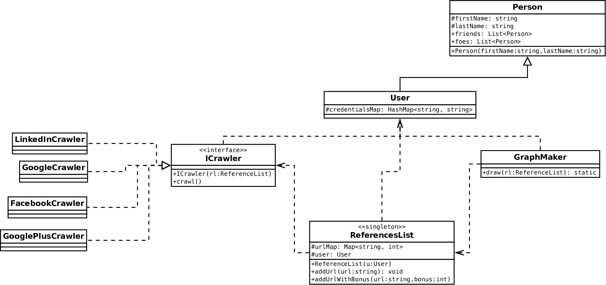

# XReputation 

Little e-reputation management tool written in java for our XML course at the ESGI.

## Architecture demonstration

This is only the architecture proposal, meant as a demonstration and request for comment. I tried to have as much isolation between the modules.
The basic gist is quite explicit in the following UML diagram :

Basically, the user is created, named and provided with services URL for each of the services that are to be crawled.

After that, the crawler a ReferenceHolder (holding all the url resulting from the crawling) is created.

This ReferenceHolder is provided as an argument to each crawler so that they can feed it with data.

The crawlers are implemented by inheriting from the abstract Crawler class. The name of the service crawled must be specified in the constructor.
The crawl() function must be overridden and implemented to do the crawling, the complain function is called if no url were provided by the user.

In the end the GraphMaker class handles the drawing.
 